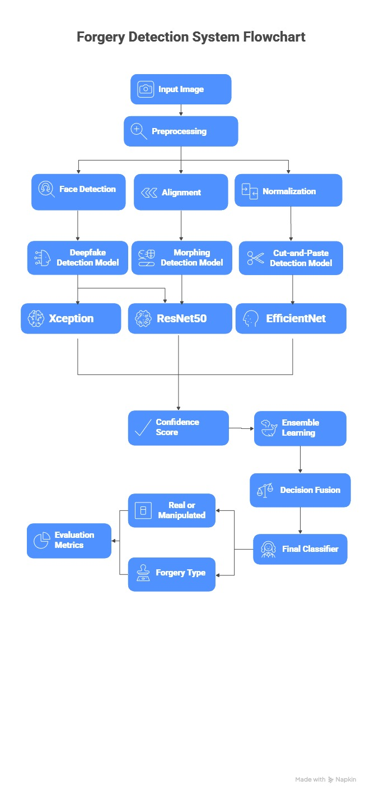

# Robust Ensemble-Based Deepfake Image Detection

## Overview

Robust Ensemble-Based Deepfake Image Detection is an AI-powered system designed to detect manipulated facial images and identify the type of forgery. The project combines multiple deep learning models using ensemble learning to improve detection accuracy, robustness, and generalization across different manipulation techniques.

The system can detect:

* Deepfake generated images
* Facial morphing attacks
* Cut-and-paste (splicing) manipulations

By combining outputs from specialized models, the system achieves highly reliable image forgery detection.

---

## Project Highlights

- Ensemble-based deepfake and image forgery detection framework
- Supports Deepfake, Morphing, and Splicing attack detection
- Uses multiple specialized CNN models with soft-voting ensemble
- Achieves robust performance across multiple datasets
- Developed as a final-year AI/ML research project

## Features

* Deepfake image detection using deep learning
* Ensemble learning with multiple ResNet models
* Detection of multiple forgery types
* Confidence score generation
* Real vs Fake image classification
* Transfer learning for improved performance
* Strong generalization across datasets

---

## Technologies Used

* Python
* TensorFlow / PyTorch
* OpenCV
* CNN (Convolutional Neural Networks)
* ResNet18 & ResNet50
* Transfer Learning
* Ensemble Learning
* NumPy & Pandas
* Matplotlib

---

## System Workflow

1. Input facial image
2. Face detection and alignment
3. Image preprocessing and normalization
4. Feature extraction using deep learning models
5. Individual forgery detection:

   * Deepfake Detection
   * Morph Detection
   * Cut-and-Paste Detection
6. Ensemble soft voting
7. Final prediction with confidence score

---

## Models Used

### Deepfake Detection

* ResNet18 model
* Detects AI-generated synthesis artifacts
* Accuracy achieved: ~96–97%

### Morph Detection

* ResNet50 model
* Detects blended facial identity manipulations
* Accuracy achieved: ~81–82%

### Cut-and-Paste Detection

* ResNet18 model
* Detects boundary inconsistencies and splicing artifacts
* Accuracy achieved: ~89%

---

## Results

* High detection accuracy for manipulated images
* Strong ROC-AUC performance
* Low false positives and false negatives
* Improved robustness using ensemble learning
* Effective classification of forgery types

---

## Datasets Used

* Kaggle Deepfake Dataset
* FFHQ Real Dataset
* AMSL Face Morph Dataset
* Custom Splicing Dataset

---
## Installation

```bash
git clone https://github.com/ManishVarma4/Robust-Ensemble-based-Deepfake-Image-Detection.git
cd Robust-Ensemble-based-Deepfake-Image-Detection
pip install -r requirements.txt
```

## Usage

1. Load the trained model weights.
2. Provide an input facial image.
3. Run the prediction pipeline.
4. View the predicted forgery type and confidence score.

## Project Structure

├── app.py
├── ensemble_decision.py
├── deepfake_resnet18_v2.pth
├── morph_model.pth
├── resnet18_splicing.pth
├── README.md

## Architecture



## Future Improvements

* Real-time video deepfake detection
* Transformer-based architecture integration
* Mobile and web deployment
* Cross-platform optimization
* Improved robustness against advanced AI-generated forgeries

---

## Team Members

* Manishkumar Varma
* Krishna Chauhan
* Bhakti Chandak
* Mandar Birewar

---

## Guide

Prof. Aparna Gurjar

Department of Computer Science and Engineering
Shri Ramdeobaba College of Engineering and Management

---

## Conclusion

This project demonstrates how ensemble learning can significantly improve deepfake image detection performance by combining multiple specialized detection models. The system provides accurate and reliable forgery detection, making it useful for cybersecurity, digital forensics, and misinformation prevention applications.
